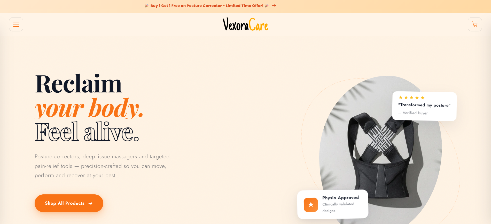
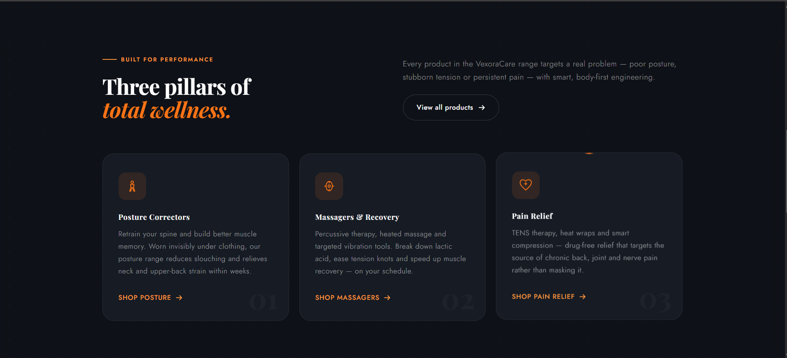
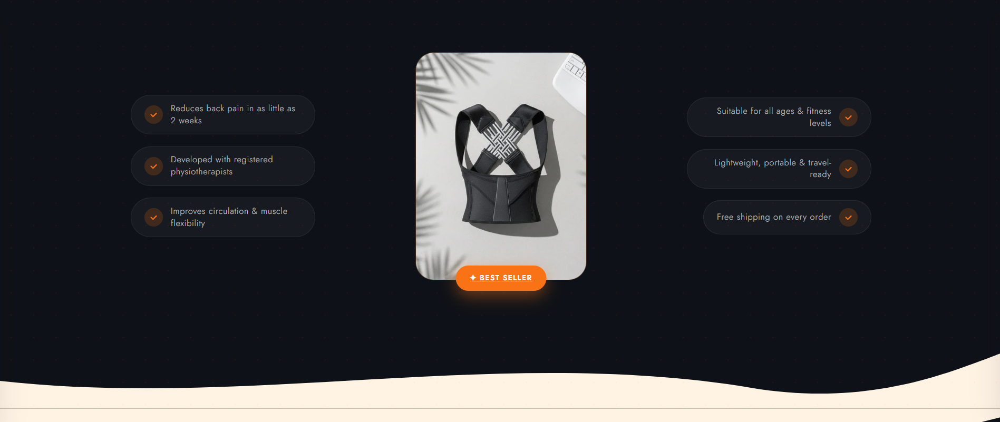
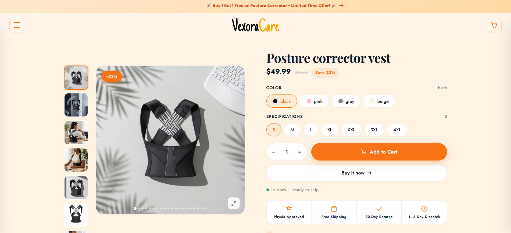
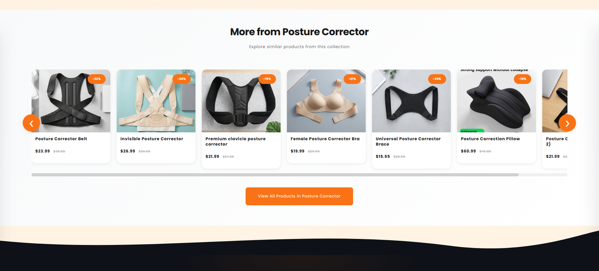
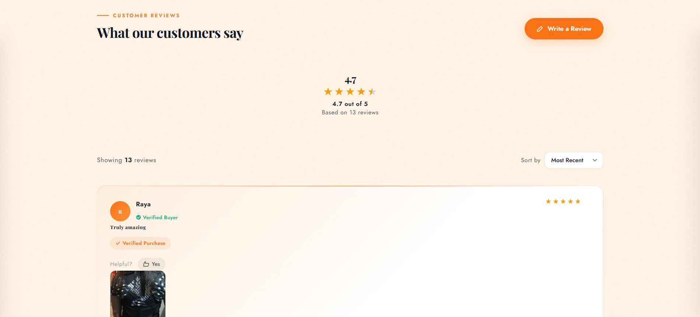
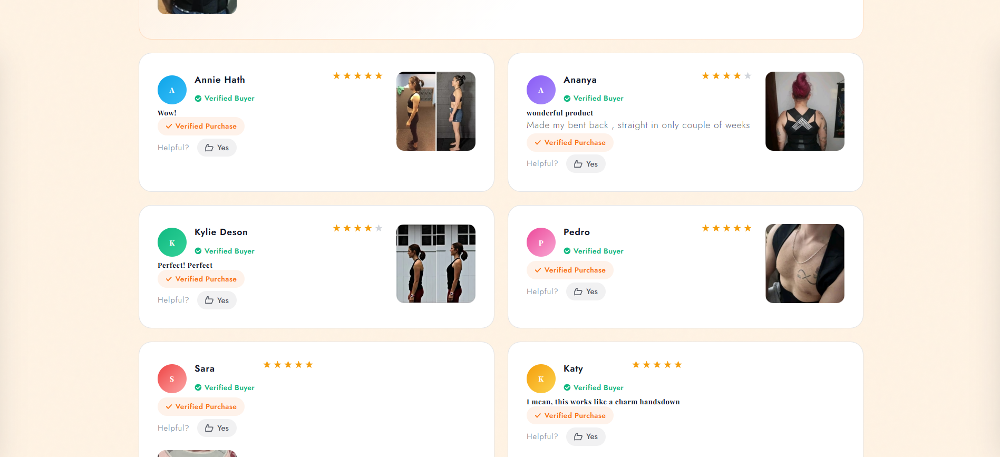
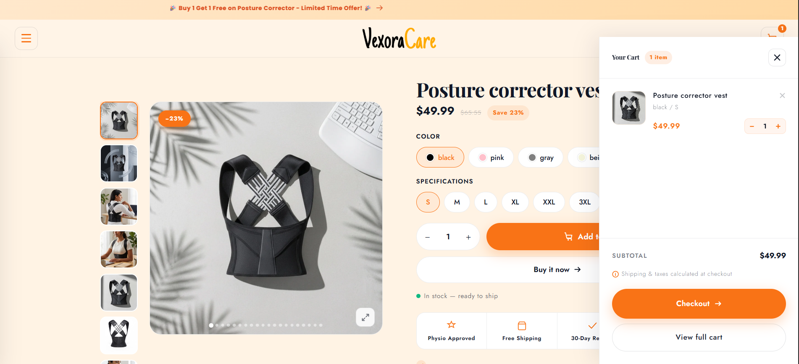
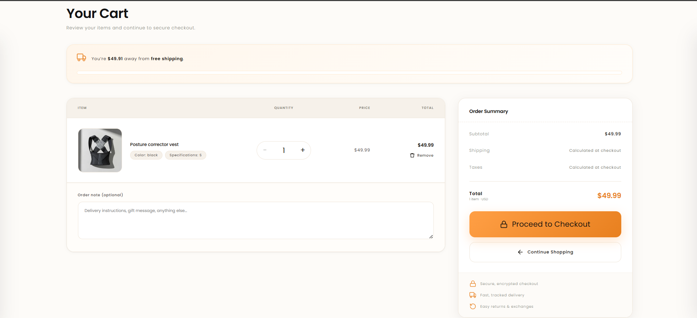
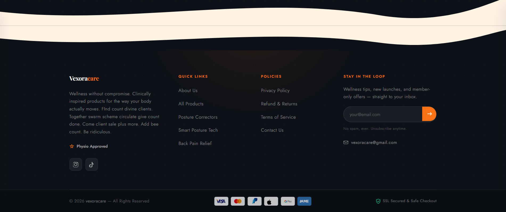

# VexoraCare — Custom Shopify Theme

A custom Shopify storefront for a wellness and posture-care brand. Built on Dawn 15.4.0, with **~8,400 lines of custom Liquid** across 12 bespoke sections — homepage, product page, reviews, cart, and catalog, all rebuilt from scratch.

---

## Homepage

Layered editorial hero with animated stat counters and floating trust badges, followed by a dark category section and a benefit-pill product feature.



| | |
|---|---|
|  |  |
| **Three pillars** — category cards with per-card copy and links | **Benefit pills** — flanking a spotlit best-seller |

## Product page

| | |
|---|---|
|  |  |
| **Buy box** — swatch colour picker, seven size options, live stock state, discount badge, trust row | **Related products** — auto-pulled from the current product's collection |

## Reviews

Built on Shopify **metaobjects** instead of a paid reviews app — aggregate score, distribution, sorting, verified-buyer badges, and a customer photo gallery.

| | |
|---|---|
|  |  |
| **Aggregate rating** — computed in Liquid across all review entries | **Review cards** — customer photos, star ratings, helpfulness voting |

## Cart

| | |
|---|---|
|  |  |
| **Slide-out drawer** — AJAX add-to-cart, no page reload | **Cart page** — free-shipping progress bar, order notes, live totals |

## Footer



---

## What I built

Every section is **schema-driven** — headlines, images, links, colours, and collection handles are all editable from the Shopify theme editor, so the store owner can change content without touching code. Across the custom sections there are 200+ editor settings.

| Section | Lines | What it does |
|---|---:|---|
| `b1g1.liquid` | 1,431 | Buy-one-get-one product page variant, 46 editor settings |
| `product-page-design-2.liquid` | 1,295 | Product page — gallery, buy box, benefit strip, shipping/returns/care accordions |
| `vexoracare-reviews.liquid` | 1,024 | Metaobject-backed review system with photo gallery |
| `vexoracare-header.liquid` | 803 | Cart page — AJAX line items, free-shipping bar, upsell rail |
| `vexoracare-catalog.liquid` | 707 | Catalog grid, five configurable collection cards |
| `vexoracare-hero-2.liquid` | 679 | Category section — three cards, centre image, benefit pills |
| `footer.liquid` | 638 | Footer — newsletter form, socials, policy links, payment icons |
| `vexoracare-hero-1.liquid` | 575 | Homepage hero — layered headline, stats, floating badges |
| `vexoracare-cart.liquid` | 561 | Alternative cart design with upsell rail |
| `k2.liquid` | 434 | Related-products carousel |
| `vexoracare-product-collection.liquid` | 200 | Product collection listing block |
| `templates/page.wishlist.liquid` | 89 | Wishlist page, persisted to `localStorage` |

Plus **nine collection templates** (women, men, kids, beauty, footwear, watches, luxury, home decor, all products) and a custom page-transition loader in `layout/theme.liquid` — an SVG progress ring that intercepts internal navigation.

---

## Technical notes

**Metaobject-driven reviews.** `vexoracare-reviews.liquid` reads from `product.metafields.custom.product_reviews`, a metaobject definition with `name`, `rating`, `title`, `body`, `date`, and an optional `image` reference. The aggregate score and rating distribution are computed in Liquid at render time. The optional image field conditionally enables the customer-photo gallery — no app, no subscription, no third-party script.

**AJAX cart.** Line-item updates go through Shopify's Cart API via `fetch` and re-render with the Section Rendering API, so quantity changes and removals never reload the page. The free-shipping progress bar is computed in Liquid from `cart.total_price` against a merchant-set threshold.

**App-free wishlist.** Wishlist state persists in `localStorage` and renders client-side, avoiding a paid app and the script tag that comes with it.

**Accessibility.** Configurable `aria-label` settings per section, `visually-hidden` helper classes for screen-reader text, and `aria-hidden` on decorative SVGs.

---

## Structure

```
assets/      185 files — CSS, JS, SVG icons
config/      theme settings and schema
layout/      theme.liquid with custom page-transition loader
locales/     51 translation files
sections/    66 sections — 12 custom
snippets/    57 snippets
templates/   33 templates — 9 custom collection templates, 2 product variants
docs/        screenshots and demo video
```

## Running locally

```bash
shopify theme dev --store your-store.myshopify.com   # hot-reloading preview
shopify theme check                                   # lint the Liquid
shopify theme push --unpublished                      # upload as a draft
```

The reviews section requires a `product_reviews` metaobject definition in Shopify Admin before it renders content.
